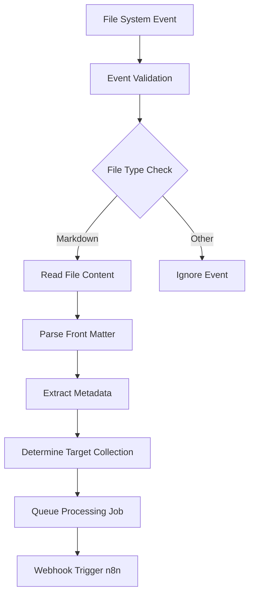
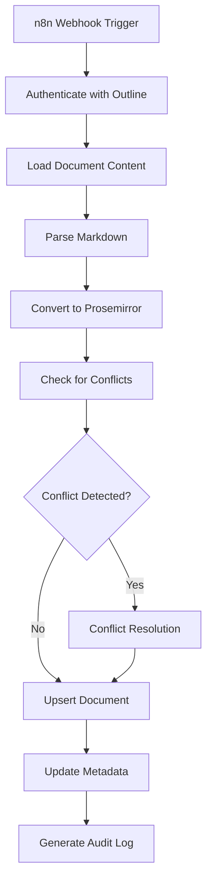
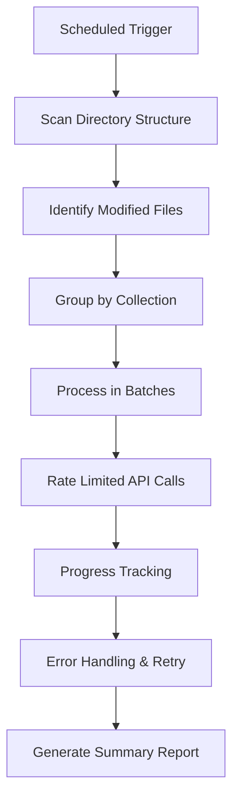

# Markdown-to-Outline Synchronization Architecture

## System Overview

This comprehensive automation architecture enables seamless synchronization between local markdown file storage systems and an Outline server instance, leveraging n8n workflow automation capabilities for real-time document management.

## Architecture Components

### 1. File System Monitoring Layer

```
┌─────────────────┐    ┌──────────────────┐    ┌─────────────────┐
│   Watchdog      │    │   Event Router   │    │  Queue Manager  │
│   (inotify)     │───▶│                  │───▶│   (Redis)       │
└─────────────────┘    └──────────────────┘    └─────────────────┘
```

**Components:**
- **File Watchdog Service**: Real-time file system monitoring using `inotify` (Linux)
- **Event Router**: Categorizes file events (create, modify, delete, move)
- **Queue Manager**: Redis-backed queue for event processing with retry logic

### 2. n8n Workflow Orchestration Engine

```
┌─────────────────┐    ┌──────────────────┐    ┌─────────────────┐
│   Webhook       │    │   Document       │    │   Outline API   │
│   Trigger       │───▶│   Processor      │───▶│   Integrator    │
│                 │    │                  │    │                 │
└─────────────────┘    └──────────────────┘    └─────────────────┘
         │                       │                       │
         ▼                       ▼                       ▼
┌─────────────────┐    ┌──────────────────┐    ┌─────────────────┐
│   Authentication│    │   Metadata       │    │   Conflict      │
│   Handler       │    │   Extractor      │    │   Resolver      │
└─────────────────┘    └──────────────────┘    └─────────────────┘
```

**Key Workflows:**
1. **File Event Processing Workflow**
2. **Document Transformation Workflow**
3. **Outline API Integration Workflow**
4. **Batch Processing Workflow**
5. **Error Recovery Workflow**

### 3. Data Processing Pipeline

```
Markdown File → Content Parser → Metadata Extractor → Document Transformer → Outline API
     │                │                │                  │                    │
     ▼                ▼                ▼                  ▼                    ▼
  inotify         gray-matter        front-matter      Markdown →         Collections
  events          parser             extractor         Prosemirror        Documents
```

## File Organization Structure

### Directory Mapping Rules

```
Local Directory Structure          →  Outline Collections
─────────────────────────────────────────────────────────────────
📁 /documents/projects/            →  🗂️ Projects Collection
📁 /documents/guides/              →  🗂️ Guides Collection  
📁 /documents/technical/           →  🗂️ Technical Docs
📁 /documents/personal/            →  🗂️ Personal Notes
📁 /documents/research/            →  🗂️ Research Collection
```

### File Naming Conventions

```
Pattern: {collection}-{category}-{name}.md

Examples:
- projects-api-design-spec.md  → Projects/API/Design/Spec
- guides-getting-started.md    → Guides/Getting/Started  
- technical-architecture.md    → Technical/Architecture
- personal-daily-notes.md      → Personal/Daily/Notes
```

### Front Matter Metadata Schema

```yaml
---
title: "Document Title"
description: "Brief description for Outline summary"
category: "api-design"
tags: [api, design, specification]
collection: "Projects"
parent_doc: "parent-document-id"  # For hierarchical structure
author: "John Doe"
created: "2025-11-16"
modified: "2025-11-16"
outline_id: "existing-outline-doc-id"  # For updates
visibility: "private"  # private, team, public
---
```

## Core Workflow Designs

### 1. File Monitoring Workflow



### 2. Document Processing Workflow



### 3. Batch Processing Workflow



## Conflict Resolution Strategy

### Conflict Detection

1. **Content Hash Comparison**: Compare SHA-256 hashes of markdown content
2. **Timestamp Analysis**: Check file modification vs. Outline lastUpdated
3. **Manual Override**: Allow user preference for source of truth

### Resolution Policies

```yaml
resolution_policies:
  local_change:
    strategy: "update_outline"
    notify: true
    backup_before: true
    
  outline_change:
    strategy: "skip_local"
    notify: true
    maintain_local_copy: true
    
  both_changed:
    strategy: "manual_merge"
    notify: true
    create_conflict_copy: true
```

### Deduplication Logic

```yaml
deduplication:
  matchers:
    - type: "title_match"
      confidence: 0.9
    - type: "content_hash"
      confidence: 1.0
    - type: "filepath_similarity"
      confidence: 0.7
  
  merge_strategies:
    - type: "metadata_merge"
      preserve_all: true
    - type: "content_newest_wins"
      timestamp_field: "modified"
```

## Authentication & Security

### Outline API Authentication

```yaml
authentication:
  method: "api_key"
  api_key_source: "environment"
  outline_url: "https://outline.example.com"
  rate_limit:
    requests_per_minute: 100
    burst_limit: 200
    retry_after: true
```

### Security Measures

- **API Key Management**: Store in environment variables with rotation
- **Request Signing**: HMAC-SHA256 for webhook verification
- **Data Encryption**: TLS 1.3 for all API communications
- **Access Control**: Role-based access to monitoring directories

## Rate Limiting & Compliance

### Outline API Rate Limits

```yaml
rate_limiting:
  global:
    requests_per_minute: 1000
    requests_per_hour: 50000
    
  per_endpoint:
    documents.create: 100/minute
    documents.update: 200/minute
    collections.list: 50/minute
    
  backoff_strategy:
    exponential:
      initial_delay: 1s
      max_delay: 60s
      multiplier: 2
```

### Compliance Mechanisms

- **Queue Throttling**: Limit concurrent processing jobs
- **Adaptive Rate Control**: Monitor API responses and adjust
- **Retry Logic**: Exponential backoff with jitter
- **Circuit Breaker**: Prevent cascading failures

## Error Handling & Recovery

### Error Classification

```yaml
error_categories:
  transient:
    - network_timeouts
    - rate_limiting
    - temporary_outline_unavailable
    
  permanent:
    - authentication_failures
    - invalid_document_format
    - collection_not_found
    
  data_conflicts:
    - duplicate_detected
    - concurrent_modifications
    - validation_failures
```

### Recovery Strategies

- **Automatic Retry**: Exponential backoff for transient errors
- **Dead Letter Queue**: Store failed events for manual intervention
- **Compensation Actions**: Rollback partial operations
- **Alerting**: Immediate notification for critical failures

## Monitoring & Observability

### Metrics Collection

```yaml
metrics:
  operational:
    - files_processed_total
    - processing_duration_seconds
    - errors_total
    - queue_size
    
  business:
    - documents_created
    - documents_updated
    - collections_synchronized
    - conflicts_detected
    
  technical:
    - api_response_time
    - rate_limit_hits
    - memory_usage
    - disk_usage
```

### Health Checks

```yaml
health_checks:
  outline_api:
    endpoint: "/api/collections"
    expected_status: 200
    
  file_monitoring:
    watchdog_process: "running"
    inotify_watches: "active"
    
  n8n_instance:
    health_endpoint: "/healthz"
    workflow_status: "active"
```

### Alerting Rules

```yaml
alerts:
  critical:
    - outline_api_down
    - file_monitoring_stopped
    - n8n_workflow_failed
    
  warning:
    - high_error_rate
    - queue_backlog_growing
    - rate_limit_frequent
```

## Audit Trail & Logging

### Audit Events

```yaml
audit_events:
  document_operations:
    - created
    - updated
    - deleted
    - moved
    
  system_events:
    - configuration_changed
    - authentication_success
    - authentication_failure
    - rate_limit_exceeded
```

### Log Format

```json
{
  "timestamp": "2025-11-16T02:51:19Z",
  "level": "INFO",
  "event_type": "document_created",
  "source": "file:///documents/projects/api-design.md",
  "outline_id": "outline-doc-123",
  "collection": "Projects",
  "user": "system",
  "metadata": {
    "processing_duration_ms": 1250,
    "file_hash": "sha256:abc123...",
    "conflict_resolution": "none"
  }
}
```

## Configuration Management

### Environment Configuration

```yaml
environment:
  outline:
    url: "${OUTLINE_URL}"
    api_key: "${OUTLINE_API_KEY}"
    
  monitoring:
    watch_directories:
      - "/documents"
    include_patterns:
      - "*.md"
    exclude_patterns:
      - ".git/*"
      - "node_modules/*"
      
  processing:
    batch_size: 10
    max_concurrent: 5
    timeout_seconds: 300
```

### Feature Flags

```yaml
feature_flags:
  enable_real_time_sync: true
  enable_batch_processing: true
  enable_conflict_resolution: true
  enable_audit_logging: true
  dry_run_mode: false
```

## Deployment Architecture

### Production Deployment

```
┌─────────────────┐    ┌──────────────────┐    ┌─────────────────┐
│   Load Balancer │    │   n8n Instance   │    │   File Watcher  │
│   (Nginx)       │───▶│                  │───▶│   Service       │
└─────────────────┘    └──────────────────┘    └─────────────────┘
         │                       │                       │
         ▼                       ▼                       ▼
┌─────────────────┐    ┌──────────────────┐    ┌─────────────────┐
│   Redis Cache   │    │   PostgreSQL     │    │   Local Storage │
│   (Sessions)    │    │   (n8n Data)     │    │   (Queues)      │
└─────────────────┘    └──────────────────┘    └─────────────────┘
```

### Container Orchestration

```yaml
# docker-compose.yml
services:
  n8n:
    image: n8nio/n8n
    environment:
      - OUTLINE_URL=${OUTLINE_URL}
      - OUTLINE_API_KEY=${OUTLINE_API_KEY}
    volumes:
      - ./workflows:/home/node/.n8n/workflows
      - ./credentials:/home/node/.n8n/credentials
      
  file-watcher:
    build: ./file-watcher
    volumes:
      - ${WATCH_DIRECTORY}:/watch
    environment:
      - REDIS_URL=redis://redis:6379
      
  redis:
    image: redis:alpine
    volumes:
      - redis_data:/data
```

## Scalability Considerations

### Horizontal Scaling

- **File Watcher Clustering**: Distribute directory watches across instances
- **n8n Worker Pool**: Multiple n8n instances for parallel processing
- **Queue Partitioning**: Shard queues by collection or directory

### Performance Optimization

- **Batch Processing**: Group operations to reduce API calls
- **Caching**: Cache collection mappings and user permissions
- **Connection Pooling**: Reuse HTTP connections to Outline API

### Resource Management

- **Memory Limits**: Bound processing memory usage
- **Disk Space**: Monitor local storage for temporary files
- **CPU Throttling**: Respect CPU limits during peak loads

## Security & Compliance

### Data Protection

- **Encryption at Rest**: Encrypt sensitive configuration files
- **Secure Transmission**: TLS for all network communications
- **Access Logging**: Audit all access to sensitive resources

### Privacy Considerations

- **PII Handling**: Secure handling of user metadata
- **Data Retention**: Configurable retention policies
- **Right to Deletion**: Support for document removal requests

This architecture provides a robust, scalable, and maintainable solution for automatic markdown-to-Outline synchronization with comprehensive monitoring, error handling, and operational visibility.